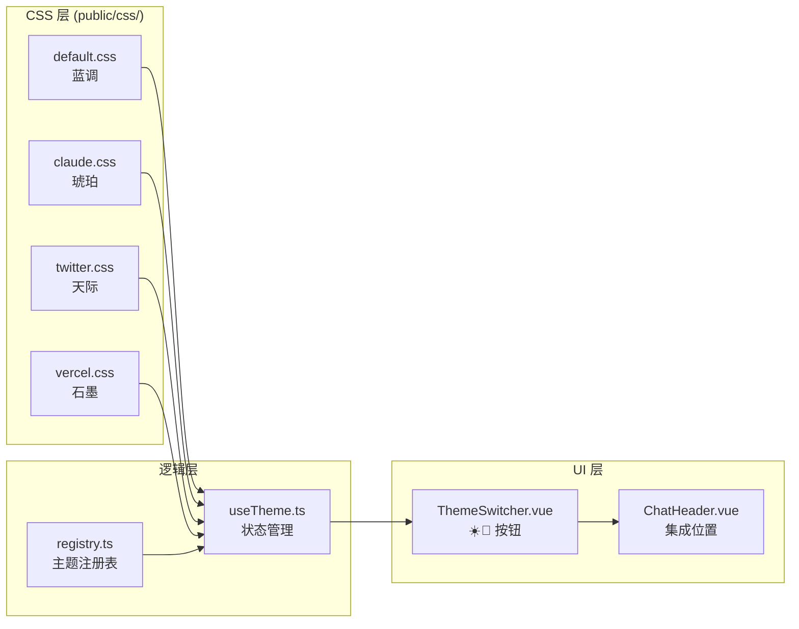

# 主题切换系统 — 实施总结

## 概览

实现了双轴主题切换系统：**深色/浅色模式** + **4 套颜色主题**，两个维度正交组合，共 8 种视觉变体。

## 架构设计

## 新增文件

| 文件 | 用途 |
|---|---|
| [public/css/default.css](file:///Users/devlink/code/github/wumacms/deepseek-api-tool/public/css/default.css) | 默认"蓝调"主题 — 经典蓝紫配色 |
| [public/css/claude.css](file:///Users/devlink/code/github/wumacms/deepseek-api-tool/public/css/claude.css) | "琥珀"主题 — 温暖棕橙色调 |
| [public/css/twitter.css](file:///Users/devlink/code/github/wumacms/deepseek-api-tool/public/css/twitter.css) | "天际"主题 — 清爽天蓝配色 |
| [public/css/vercel.css](file:///Users/devlink/code/github/wumacms/deepseek-api-tool/public/css/vercel.css) | "石墨"主题 — 极简黑白风格 |
| [public/css/supabase.css](file:///Users/devlink/code/github/wumacms/deepseek-api-tool/public/css/supabase.css) | "翡翠"主题 — 清新翠绿配色（新加入） |
| [src/themes/registry.ts](file:///Users/devlink/code/github/wumacms/deepseek-api-tool/src/themes/registry.ts) | 主题注册表 — 唯一配置中心 |
| [src/composables/useTheme.ts](file:///Users/devlink/code/github/wumacms/deepseek-api-tool/src/composables/useTheme.ts) | 主题状态管理 composable |
| [src/components/ThemeSwitcher.vue](file:///Users/devlink/code/github/wumacms/deepseek-api-tool/src/components/ThemeSwitcher.vue) | 主题切换 UI 组件 |

## 修改文件

| 文件 | 改动要点 |
|---|---|
| [src/style.css](file:///Users/devlink/code/github/wumacms/deepseek-api-tool/src/style.css) | 全部重写 — 所有硬编码颜色替换为 CSS 变量；`@theme` 块添加 Tailwind 颜色映射 |
| [src/main.ts](file:///Users/devlink/code/github/wumacms/deepseek-api-tool/src/main.ts) | 添加 `initTheme()` 调用防止 FOUC |
| [index.html](file:///Users/devlink/code/github/wumacms/deepseek-api-tool/index.html) | 添加内联脚本防止 FOUC |
| [src/App.vue](file:///Users/devlink/code/github/wumacms/deepseek-api-tool/src/App.vue) | 集成 useTheme + 颜色类迁移 |
| [src/components/ChatHeader.vue](file:///Users/devlink/code/github/wumacms/deepseek-api-tool/src/components/ChatHeader.vue) | 集成 ThemeSwitcher + 颜色类迁移 |
| [src/components/ChatSidebar.vue](file:///Users/devlink/code/github/wumacms/deepseek-api-tool/src/components/ChatSidebar.vue) | 颜色类迁移 |
| [src/components/ChatHistoryPanel.vue](file:///Users/devlink/code/github/wumacms/deepseek-api-tool/src/components/ChatHistoryPanel.vue) | 颜色类迁移 |
| [src/components/ChatMessage.vue](file:///Users/devlink/code/github/wumacms/deepseek-api-tool/src/components/ChatMessage.vue) | 颜色类迁移 |
| [src/components/ChatInput.vue](file:///Users/devlink/code/github/wumacms/deepseek-api-tool/src/components/ChatInput.vue) | 颜色类迁移 |
| [src/components/StreamingMessage.vue](file:///Users/devlink/code/github/wumacms/deepseek-api-tool/src/components/StreamingMessage.vue) | 颜色类迁移 |

## 主题 CSS 变量体系

每套主题 CSS 文件定义 `:root`（浅色）和 `.dark`（深色）两组变量，包含：

- **基础语义色**: `--background`, `--foreground`, `--card`, `--primary`, `--muted`, `--accent`, `--destructive`, `--border`, `--ring`
- **功能色**: `--thinking` (思维链紫色), `--success` (绿色), `--warning` (黄色), `--code-inline` (行内代码高亮)
- **玻璃拟态**: `--glass-bg`, `--glass-border`, `--glass-input-*`
- **环境光效**: `--ambient-1`, `--ambient-2`, `--ambient-base`
- **气泡色**: `--user-bubble-*`, `--assistant-*`
- **辅助**: `--header-bg`, `--scrollbar-thumb`

## 扩展新主题

只需 **2 步**：

1. 在 `public/css/` 下新增 CSS 文件，定义 `:root` 和 `.dark` 两组变量
2. 在 [registry.ts](file:///Users/devlink/code/github/wumacms/deepseek-api-tool/src/themes/registry.ts) 的 `COLOR_THEMES` 数组中添加一条记录

无需修改任何逻辑代码或 UI 组件。

## 验证

- ✅ `pnpm build` TypeScript 编译 + Vite 构建通过，零错误
- 运行中的 `pnpm dev` 可实时预览效果
