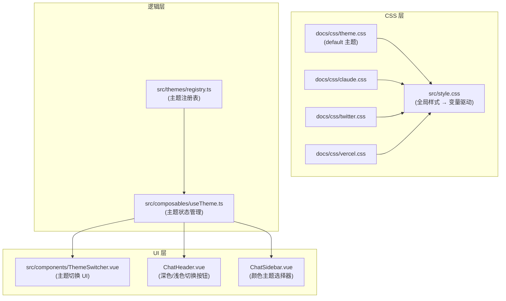

# 深色/浅色模式 + 颜色主题切换功能设计

## 背景

当前项目是一个基于 Vue 3 + Tailwind CSS 4 + Vite 的 DeepSeek Chat 沙箱应用。现有 `docs/css/` 目录下已有 4 套颜色主题文件（`theme.css`、`claude.css`、`twitter.css`、`vercel.css`），每套均定义了 `:root`（浅色）和 `.dark`（深色）两组 CSS 变量。

当前应用的 [style.css](file:///Users/devlink/code/github/wumacms/deepseek-api-tool/src/style.css) **全部使用硬编码颜色**（如 `#080b11`、`rgba(59, 130, 246, 0.5)` 等），并未使用 CSS 变量。这意味着需要将全局样式改造为变量驱动。

**本次需求包含两个独立轴：**

| 轴 | 维度 | 取值 |
|---|---|---|
| **模式 (Mode)** | 深色 / 浅色 | `dark` · `light` · `system` |
| **颜色主题 (Color Theme)** | 品牌配色 | `default` · `claude` · `twitter` · `vercel` |

两个轴正交组合，例如用户可以选择 "Claude 主题 + 浅色模式" 或 "Vercel 主题 + 深色模式"。

---

## User Review Required

> [!IMPORTANT]
> **样式迁移范围**: 当前 [style.css](file:///Users/devlink/code/github/wumacms/deepseek-api-tool/src/style.css) 中所有颜色均为硬编码值，迁移到 CSS 变量后视觉效果会有细微差异。我会尽量保持与现有深色主题一致的视觉风格，但浅色模式为全新设计。

> [!WARNING]
> **组件模板改造**: 现有组件（如 `ChatHeader.vue`、`ChatSidebar.vue`、`App.vue` 等）中大量使用硬编码颜色类（如 `text-white`、`bg-[#080b11]`、`text-gray-400` 等），需要批量替换为语义化 CSS 变量。这属于涉及面较广的重构。

---

## Open Questions

> [!IMPORTANT]
> **Q1: 主题切换 UI 的位置**  
> 我计划将 **深色/浅色切换** 放在 **ChatHeader 右侧操作区**（紧凑的图标按钮），将 **颜色主题选择器** 放在 **ChatSidebar 的"API 配置"tab** 底部（下拉选择 + 主题预览色块）。这个布局是否符合你的预期？

> [!IMPORTANT]
> **Q2: 系统偏好跟随**  
> 是否需要支持 `system` 模式（即自动跟随操作系统的深色/浅色设置）？还是只需要手动的 `dark` / `light` 两档切换？

---

## 整体架构设计



---

## Proposed Changes

### 1. 主题注册表 (Theme Registry)

#### [NEW] [registry.ts](file:///Users/devlink/code/github/wumacms/deepseek-api-tool/src/themes/registry.ts)

定义主题注册表，作为唯一的主题配置中心。**扩展新主题只需在此添加一条记录 + 对应 CSS 文件**。

```typescript
export interface ColorTheme {
  id: string;           // 唯一标识符，如 'default', 'claude'
  name: string;         // 显示名称，如 '默认主题'
  description: string;  // 简短描述
  previewColor: string; // 预览色块的代表色 (用于 UI 展示)
  cssPath: string;      // CSS 文件路径 (相对于 public 或 docs)
}

export type ThemeMode = 'light' | 'dark' | 'system';

export const COLOR_THEMES: ColorTheme[] = [
  {
    id: 'default',
    name: '默认主题',
    description: '经典蓝灰配色',
    previewColor: 'oklch(0.81 0.1 252)',
    cssPath: '/css/theme.css',
  },
  {
    id: 'claude',
    name: 'Claude',
    description: '温暖的棕橙色调',
    previewColor: 'oklch(0.6171 0.1375 39.0427)',
    cssPath: '/css/claude.css',
  },
  {
    id: 'twitter',
    name: 'Twitter',
    description: '清爽的天蓝配色',
    previewColor: 'oklch(0.6723 0.1606 244.9955)',
    cssPath: '/css/twitter.css',
  },
  {
    id: 'vercel',
    name: 'Vercel',
    description: '极简黑白风格',
    previewColor: 'oklch(0 0 0)',
    cssPath: '/css/vercel.css',
  },
];

export const DEFAULT_THEME_ID = 'default';
export const DEFAULT_MODE: ThemeMode = 'dark';
```

---

### 2. 主题状态管理 (Composable)

#### [NEW] [useTheme.ts](file:///Users/devlink/code/github/wumacms/deepseek-api-tool/src/composables/useTheme.ts)

核心 composable，管理主题的所有状态和副作用。

**核心职责：**
- 管理 `colorThemeId` (当前颜色主题) 和 `mode` (深色/浅色/系统)
- 动态注入/替换 CSS 样式表（使用 `<link>` 标签动态替换）
- 在 `<html>` 元素上切换 `.dark` class
- 监听 `prefers-color-scheme` 媒体查询（system 模式时）
- 持久化到 `localStorage`（键名：`deepseek_color_theme`、`deepseek_theme_mode`）
- 提供 `toggleMode()` 快捷切换方法
- 提供 `setColorTheme(id)` 方法

**关键实现细节：**

```typescript
// 伪代码示意
export function useTheme() {
  const colorThemeId = ref(localStorage.getItem('deepseek_color_theme') || DEFAULT_THEME_ID);
  const mode = ref<ThemeMode>(localStorage.getItem('deepseek_theme_mode') as ThemeMode || DEFAULT_MODE);
  const resolvedMode = computed(() => {
    if (mode.value === 'system') return systemPrefersDark.value ? 'dark' : 'light';
    return mode.value;
  });

  // 动态加载 CSS：创建/更新 <link id="color-theme-stylesheet"> 
  // 切换 dark class：document.documentElement.classList.toggle('dark', resolvedMode === 'dark')
  
  return { colorThemeId, mode, resolvedMode, currentTheme, toggleMode, setColorTheme, setMode };
}
```

---

### 3. CSS 文件改造

#### [MODIFY] [style.css](file:///Users/devlink/code/github/wumacms/deepseek-api-tool/src/style.css)

将所有硬编码颜色替换为 CSS 变量引用。主要变更点：

| 原始硬编码值 | 替换为 CSS 变量 |
|---|---|
| `#080b11` (背景色) | `var(--background)` |
| `#f3f4f6` (前景文字) | `var(--foreground)` |
| `rgba(17, 24, 39, 0.6)` (玻璃面板) | `color-mix(in oklch, var(--card) 60%, transparent)` |
| `rgba(255, 255, 255, 0.08)` (边框) | `color-mix(in oklch, var(--border) 40%, transparent)` |
| `rgba(59, 130, 246, ...)` (蓝色强调) | `var(--primary)` / `var(--ring)` |
| `rgba(139, 92, 246, ...)` (紫色) | `var(--chart-2)` |
| `#3b82f6` (链接/光标) | `var(--primary)` |
| `#ffffff` (标题白色) | `var(--foreground)` |
| `#9ca3af` / `#6b7280` (次级灰色) | `var(--muted-foreground)` |

> [!NOTE]
> 为了保证深色模式下的半透明玻璃效果，会使用 `color-mix()` 函数将 CSS 变量与透明色混合，而非直接修改 oklch 的 alpha 通道。

#### [NEW] CSS 文件需要从 `docs/css/` 复制到 `public/css/`

主题 CSS 文件需要放置在 `public/css/` 目录下（Vite 静态资源），以便运行时通过 `<link>` 标签动态加载。

---

### 4. UI 组件

#### [NEW] [ThemeSwitcher.vue](file:///Users/devlink/code/github/wumacms/deepseek-api-tool/src/components/ThemeSwitcher.vue)

**颜色主题选择器**（放在侧边栏底部），包含：
- 4 个主题预览色块按钮，当前激活主题高亮
- 每个色块显示主题名称 tooltip

#### [MODIFY] [ChatHeader.vue](file:///Users/devlink/code/github/wumacms/deepseek-api-tool/src/components/ChatHeader.vue)

在右侧操作区新增一个 **Sun/Moon 图标按钮**：
- 点击在 `dark` ↔ `light` 之间切换（若支持 system 模式则三档轮转：`dark → light → system`）
- 使用 Lucide 的 `Sun` / `Moon` / `Monitor` 图标
- 切换时带旋转微动画

#### [MODIFY] 各组件硬编码颜色改造

以下组件中的硬编码颜色 Tailwind 类需要替换为语义化变量：

| 组件 | 主要改动 |
|---|---|
| [App.vue](file:///Users/devlink/code/github/wumacms/deepseek-api-tool/src/App.vue) | `text-white` → `text-[var(--foreground)]`；`bg-white/5` → 使用变量 |
| [ChatHeader.vue](file:///Users/devlink/code/github/wumacms/deepseek-api-tool/src/components/ChatHeader.vue) | `bg-[#080b11]/80` → `bg-[var(--background)]`；文字颜色替换 |
| [ChatSidebar.vue](file:///Users/devlink/code/github/wumacms/deepseek-api-tool/src/components/ChatSidebar.vue) | 表单控件颜色替换 |
| [ChatMessage.vue](file:///Users/devlink/code/github/wumacms/deepseek-api-tool/src/components/ChatMessage.vue) | 消息气泡颜色 |
| [ChatInput.vue](file:///Users/devlink/code/github/wumacms/deepseek-api-tool/src/components/ChatInput.vue) | 输入框颜色 |
| [ChatHistoryPanel.vue](file:///Users/devlink/code/github/wumacms/deepseek-api-tool/src/components/ChatHistoryPanel.vue) | 列表项颜色 |
| [StreamingMessage.vue](file:///Users/devlink/code/github/wumacms/deepseek-api-tool/src/components/StreamingMessage.vue) | 流式消息颜色 |

---

### 5. 入口集成

#### [MODIFY] [main.ts](file:///Users/devlink/code/github/wumacms/deepseek-api-tool/src/main.ts)

在应用启动前初始化主题（避免闪烁）：
```typescript
import { initTheme } from './composables/useTheme';
initTheme(); // 在 createApp 之前执行，防止 FOUC
```

#### [MODIFY] [index.html](file:///Users/devlink/code/github/wumacms/deepseek-api-tool/index.html)

在 `<head>` 中添加内联脚本，实现最早期的主题初始化（避免白屏闪烁）：
```html
<script>
  // 防止 FOUC：在 DOM 解析前立即应用主题
  (function() {
    const mode = localStorage.getItem('deepseek_theme_mode') || 'dark';
    const isDark = mode === 'dark' || (mode === 'system' && window.matchMedia('(prefers-color-scheme: dark)').matches);
    if (isDark) document.documentElement.classList.add('dark');
  })();
</script>
```

---

## 扩展性设计

添加一个新颜色主题只需 **2 步**：

1. 在 `public/css/` 下新增一个 CSS 文件（如 `github.css`），定义 `:root` 和 `.dark` 两组变量
2. 在 [registry.ts](file:///Users/devlink/code/github/wumacms/deepseek-api-tool/src/themes/registry.ts) 的 `COLOR_THEMES` 数组中添加一条记录

无需修改任何逻辑代码或 UI 组件。

---

## 文件变更总览

```
src/
├── themes/
│   └── registry.ts              [NEW]  主题注册表
├── composables/
│   └── useTheme.ts              [NEW]  主题状态管理 composable
├── components/
│   ├── ThemeSwitcher.vue        [NEW]  颜色主题选择器 UI
│   ├── ChatHeader.vue           [MODIFY] 加入深色/浅色切换按钮 + 颜色改造
│   ├── ChatSidebar.vue          [MODIFY] 集成 ThemeSwitcher + 颜色改造
│   ├── ChatMessage.vue          [MODIFY] 颜色改造
│   ├── ChatInput.vue            [MODIFY] 颜色改造
│   ├── ChatHistoryPanel.vue     [MODIFY] 颜色改造
│   └── StreamingMessage.vue     [MODIFY] 颜色改造
├── App.vue                      [MODIFY] 颜色改造
├── style.css                    [MODIFY] 硬编码颜色 → CSS 变量
├── main.ts                      [MODIFY] 主题初始化
public/
└── css/
    ├── theme.css                [NEW]  从 docs/css/ 复制
    ├── claude.css               [NEW]  从 docs/css/ 复制
    ├── twitter.css              [NEW]  从 docs/css/ 复制
    └── vercel.css               [NEW]  从 docs/css/ 复制
index.html                       [MODIFY] FOUC 防护脚本
```

---

## Verification Plan

### Automated Tests
- `pnpm build` — 确认 TypeScript 编译和 Vite 构建无报错

### Manual Verification
- 验证 **深色/浅色模式切换** 在 4 套颜色主题下均表现正常
- 验证 **颜色主题切换** 时 CSS 变量实时生效，无页面闪烁
- 验证 **刷新页面** 后主题设置持久化
- 验证 **首次加载** 无白屏闪烁（FOUC 防护）
- 验证 **移动端** 布局正常
